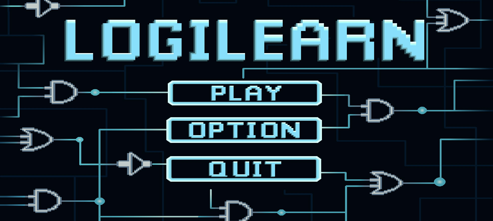
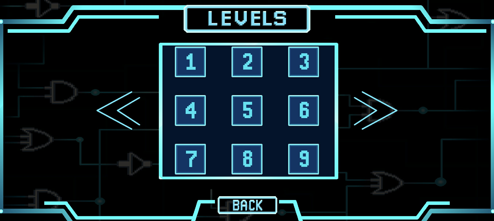
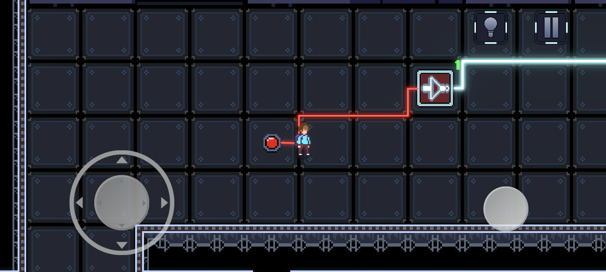
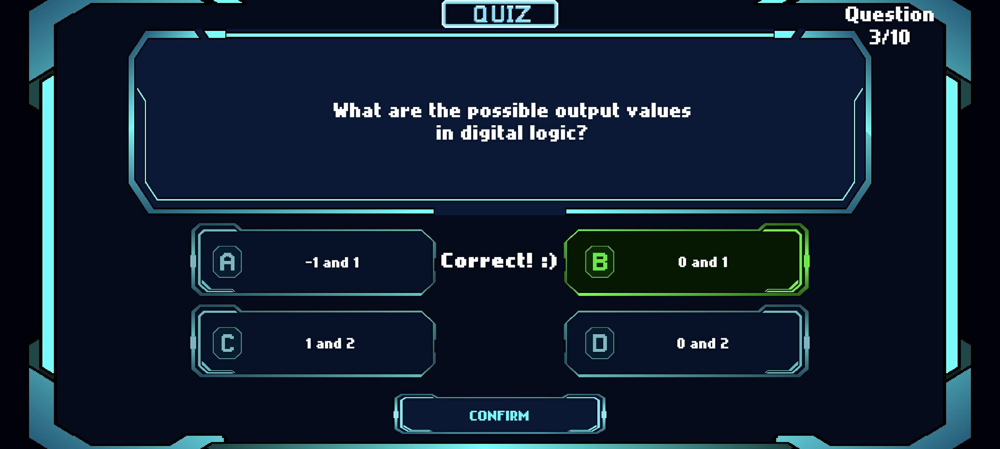

# LogiLearn

LogiLearn is a 2D educational puzzle game designed to help learners understand Logic Gates and Boolean Algebra through interactive gameplay.

The project was developed as a thesis project with the goal of providing a more engaging and interactive approach to learning fundamental concepts in digital logic.

## About the Project

Learning logic gates and Boolean algebra can be challenging when concepts are presented primarily through traditional lectures, diagrams, and written exercises.

LogiLearn addresses this by combining educational content with 2D puzzle-game mechanics. Players learn and apply logic-gate concepts by solving interactive challenges and progressing through different levels.

The game introduces logic concepts progressively, allowing players to apply what they have learned through gameplay.

## Objectives

The project aims to:

Develop an educational game for learning fundamental logic-gate concepts.
Provide interactive activities for practicing Boolean Algebra.
Make learning digital logic more engaging through game-based learning.
Allow learners to apply theoretical concepts through puzzles and challenges.
Provide progressive levels that introduce increasingly complex logic concepts.

## Features

* 2D puzzle-based gameplay
* Logic gate challenges
* Boolean Algebra exercises
* Progressive learning levels
* Interactive logic puzzles
* Educational quizzes
* Logic-based problem solving
* Progressive difficulty

## Logic Gates

LogiLearn covers the following fundamental logic gates:

* Buffer
* NOT
* AND
* OR
* NAND
* NOR
* XOR
* XNOR

Players encounter these concepts through different gameplay challenges and activities.

## Gameplay

The game introduces concepts progressively, beginning with basic mechanics before moving into more advanced logic challenges.

Players are expected to:

1. Learn the basic concept introduced in the level.
2. Examine the provided logic problem.
3. Interact with the puzzle elements.
4. Apply the appropriate logic-gate concept.
5. Solve the challenge.
6. Progress to the next level.

## 📸 Screenshots

### Main Menu

### Levels

### Gameplay and Quiz

## Download

**[Download LogiLearn](../../releases/latest)**

The latest playable version can be found in the GitHub **Releases** section.

## Technologies Used

* Unity
* C#
* Android
* Aseprite
* Krita

## Project Status

**Prototype / In Development**

LogiLearn is a thesis project currently under development. Gameplay, educational content, and features may change as the project is improved and evaluated.

## Developer

Created by **Mohn Jasfer C. Pestaño, 
Jean Cedric L. Sebastian, Timmy G. Dela Cruz and Flourence V. Quizon**

## License

LogiLearn is an academic project developed for educational purposes. The current version may contain incomplete features, bugs, or experimental gameplay elements.
